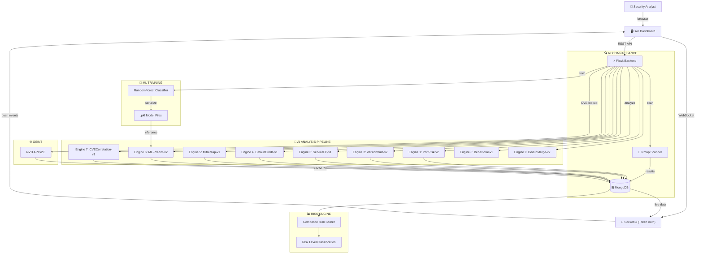

```
    ███╗   ██╗███████╗██╗  ██╗███████╗██╗  ██╗██╗███████╗██╗     ██████╗
    ████╗  ██║██╔════╝╚██╗██╔╝██╔════╝██║  ██║██║██╔════╝██║     ██╔══██╗
    ██╔██╗ ██║█████╗   ╚███╔╝ ███████╗███████║██║█████╗  ██║     ██║  ██║
    ██║╚██╗██║██╔══╝   ██╔██╗ ╚════██║██╔══██║██║██╔══╝  ██║     ██║  ██║
    ██║ ╚████║███████╗██╔╝ ██╗███████║██║  ██║██║███████╗███████╗██████╔╝
    ╚═╝  ╚═══╝╚══════╝╚═╝  ╚═╝╚══════╝╚═╝  ╚═╝╚═╝╚══════╝╚══════╝╚═════╝
```

<p align="center">
  <b>🛡️ AI-Powered Threat Intelligence Platform 🤖</b><br>
  <i>multi-model • real-time • offensive-ready</i><br><br>
  
  
  
  
  
  
  
</p>

---

## `> whoami`

NexShield is an **AI-driven cybersecurity dashboard** that automates network reconnaissance, identifies vulnerabilities across 28+ sensitive services, maps findings to **MITRE ATT&CK** techniques, and deduplicates threats using an advanced 9-engine analysis pipeline — all delivered through a real-time WebSocket-powered Mission Control interface.

```
┌──────────────────────────────────────────────────────────┐
│  "Scan. Analyze. Score. Hunt."                           │
│                                                          │
│  [✓] 9 AI Analysis Engines                               │
│  [✓] 28 Sensitive Port Signatures                         │
│  [✓] 13 CVE Vulnerability Pattern Matchers                │
│  [✓] 13 Default-Credential Detectors                      │
│  [✓] 11 MITRE ATT&CK Technique Mappings                   │
│  [✓] 8 Behavioral Anomaly Combo Detectors                  │
│  [✓] ML-Trained RandomForest Severity Classifier           │
│  [✓] Composite Multi-Dimensional Host Risk Scoring         │
│  [✓] NVD CVE Lookup with MongoDB Caching (7-day TTL)       │
│  [✓] Real-Time WebSocket Events (Token-Authenticated)      │
│  [✓] Background Thread Execution (Scan/Analyze/Train)      │
│  [✓] Security Headers & Input Validation Middleware         │
└──────────────────────────────────────────────────────────┘
```

---

## `> cat /etc/architecture`



---

## `> ls -la engines/`

| # | Engine | Codename | What It Does |
|---|--------|----------|--------------|
| 1 | **Port Risk** | `PortRisk-Engine-v2` | Flags 28 sensitive ports (RDP, SMB, VNC, Redis, Meterpreter, etc.) |
| 2 | **Version Vuln** | `VersionVuln-Engine-v2` | Regex CVE matching — Heartbleed, SambaCry, vsftpd backdoor, Log4Shell, ProxyLogon, Spring4Shell |
| 3 | **Service Fingerprint** | `ServiceFP-Engine-v1` | Detects anomalous services on standard ports (masquerading/backdoors) |
| 4 | **Default Credentials** | `DefaultCreds-Engine-v1` | Flags 13 services with known weak/default creds |
| 5 | **MITRE ATT&CK Map** | `MitreMap-Engine-v1` | Maps findings to 11 ATT&CK techniques (T1021, T1071, T1190, T1210) |
| 6 | **ML Predict** | `ML-Predict-Engine-v2` | RandomForest classifier trained on historical + synthetic exploit signatures |
| 7 | **CVE Correlation** | `CVECorrelation-Engine-v1` | Cross-references scan discoveries directly against cached NVD CVEs |
| 8 | **Behavioral** | `Behavioral-Engine-v1` | Host-level anomaly detection — 8 suspicious port combination patterns |
| 9 | **Deduplication** | `DedupMerge-Engine-v2` | Merges duplicate threats intelligently, preserves provenance |

---

## `> cat /etc/ai_methodology` (Update Report)

### AI Model Training Methodology & Reference Material
The machine learning threat classification engine (`ML-Predict-Engine-v2`) in NexShield is trained using real-world exploit profiles strictly referenced from comprehensive penetration testing source materials. 

**Reference Document:** *Georgia Weidman's "Penetration Testing - A hands-on introduction to Hacking.pdf"*

To effectively emulate a live analyst analyzing attack patterns, the prediction model's synthetic training dataset is heavily weighted with exact attack vectors natively instructed within the above reference material. These targeted signatures actively drive the classification severity parameters:
*   **MS08-067 (NetAPI) Exploit paths:** Critical risk identification mapping for SMB exposures on port `445`.
*   **vsftpd v2.3.4 Backdoors:** Critical severity profiling tied to port `21` and default anonymous payloads.
*   **Tomcat Application Manager Intrusions:** High severity identification profiling port `8080` targeting default administrative privileges. 
*   **Post-Exploitation Handlers:** Critical baseline identification for standard Metasploit Meterpreter Reverse TCP bindings (`4444`).
*   **Host-Level Lateral Movement Corollaries:** Specific mappings tracking behavior where multiple service exposures directly facilitate lateral or vertical privilege escalation (for example `RDP + SMB` or `SSH + NoSQL/MySQL`).

### Extended CVE Pattern Library (v2)
The `VersionVuln-Engine-v2` now matches against **13 known vulnerable product signatures**, including modern critical CVEs:
*   `CVE-2021-44228` — **Log4Shell** (Log4j 2.x RCE)
*   `CVE-2022-22965` — **Spring4Shell** (Spring Framework RCE)
*   `CVE-2021-26855` — **ProxyLogon** (Microsoft Exchange SSRF)
*   `CVE-2014-0160` — **Heartbleed** (OpenSSL memory leak)
*   `CVE-2017-7494` — **SambaCry** (Samba RCE)
*   `CVE-2011-2523` — **vsftpd Backdoor** (vsftpd 2.x)
*   Plus 7 additional patterns covering Apache, OpenSSH, Nginx, ProFTPD, MSSQL, MySQL, and MariaDB.

### Composite Risk Scoring Algorithm
The `compute_risk_scores()` engine calculates a multi-dimensional risk score per host:
1.  **Weighted Severity Sum** — `critical=10, high=7, medium=4, low=2`
2.  **Engine Diversity Bonus** — `engines_flagged × 2` (more engines = higher systemic confidence)
3.  **Volume Factor** — `min(threat_count × 0.5, 15)` (exposure modifier)

Risk classification thresholds: `Critical ≥ 40 | High ≥ 25 | Medium ≥ 12 | Low < 12`

---

## `> cat features.log`

```
[+] 🌍 IP-First Host Risk Map     — Tactical glowing telemetry grid mapping active nodes
[+] 🛡️ Zero-Trust Host Quarantine — Instantly isolate compromised nodes and neutralize threats
[+] ⚛️ Deep-Dive IP Profiling    — Fetch targeted Nmap footprint telemetry (Ports/Services)
[+] 🎯 Targeted Node Scanning     — Re-scan and re-profile individual IPs seamlessly
[+] 📊 HUD Severity Radar         — Real-time HUD showing critical threat distribution
[+] 📈 7-Day Incident Timeline    — Canvas-rendered stacked trend curves (configurable up to 30 days)
[+] 🔍 Threat Detail Matrix       — Click any row → full intel slide-in correlation
[+] 📥 Export Reports             — Download intelligence as CSV or JSON (filterable by host/severity)
[+] 🌐 CVE Lookup Cache           — Query NVD v2.0 database for real CVE details (7-day TTL)
[+] 📋 Activity Log               — Live scrolling operations telemetry feed
[+] 🤖 ML Model Training          — Train RandomForest classifier on historical + synthetic data
[+] 📡 WebSocket Push Events       — Real-time scan/analysis/quarantine notifications (token-auth)
[+] 🔒 Security Headers           — X-Content-Type-Options, X-Frame-Options, Referrer-Policy
[+] 🧵 Background Execution       — Scans, analysis, and training run in daemon threads
[+] 📊 Threat Trends Analytics    — Severity distribution, source breakdown, and tag frequency
[+] 🗂️ Scan History               — Browse past reconnaissance sessions grouped by scan ID
```

---

## `> ./install.sh` — Setup

### 🐉 Kali Linux / Debian

```bash
# ── Prerequisites ────────────────────────────────────
sudo apt update && sudo apt install nmap -y

# ── MongoDB (Kali) ───────────────────────────────────
sudo apt install mongodb -y
sudo systemctl start mongodb
sudo systemctl enable mongodb

# ── Clone & Setup ────────────────────────────────────
git clone https://github.com/nextboxis/NexShield.git
cd NexShield
python3 -m venv venv
source venv/bin/activate
pip install -r requirements.txt
```

### 🪟 Windows (PowerShell)

```powershell
# ── Prerequisites ────────────────────────────────────
# Download Nmap:   https://nmap.org/download.html
# Download MongoDB: https://www.mongodb.com/try/download/community

# ── Clone & Setup ────────────────────────────────────
git clone https://github.com/nextboxis/NexShield.git
cd NexShield
python -m venv venv
.\venv\Scripts\activate
pip install -r requirements.txt
```

### 📦 Dependencies

| Package | Purpose |
|---------|---------|
| `flask>=3.0` | Web framework & REST API |
| `flask-socketio>=5.3` | WebSocket real-time events |
| `flask-cors>=4.0` | Cross-origin resource sharing |
| `flask-pymongo>=2.3` | MongoDB Flask integration |
| `pymongo>=4.6` | MongoDB driver |
| `python-nmap>=0.7` | Nmap scanning wrapper |
| `requests>=2.31` | HTTP client (NVD API) |
| `scikit-learn>=1.4.0` | ML model training (RandomForest) |
| `joblib>=1.3.0` | Model serialization |
| `dnspython>=2.5` | DNS resolution utilities |

---

## `> python app.py`

```bash
$ python app.py

==========================================================
   NexShield — AI-Powered Threat Intelligence Platform
   Dashboard -> http://127.0.0.1:5000
==========================================================
 * Serving Flask app 'app'
 * Running on http://0.0.0.0:5000
```

> Open `http://127.0.0.1:5000` in your browser. 🌐

*(The platform is configured for instant Mission Control access — no authentication barrier is present).*

---

## `> tree .`

```
nexshield/
├── app.py                  # Flask API + SocketIO — 17 endpoints
├── ai_logic.py             # 9-engine AI analysis pipeline (823 lines)
├── scanner.py              # Nmap-powered network scanner
├── config.py               # MongoDB connection & 5 collections
├── cve_lookup.py           # NVD API v2.0 integration + 7-day cache
├── requirements.txt        # 12 Python dependencies
├── threat_ml_model.pkl     # Trained RandomForest classifier
├── threat_ml_vect.pkl      # TF-IDF vectorizer (serialized)
├── README.md               # ← you are here
├── templates/
│   └── index.html          # Live dashboard (dark-mode, ~11KB)
└── static/
    ├── css/
    │   └── style.css       # Cybersecurity aesthetic (~30KB)
    └── js/
        └── script.js       # Frontend logic + Canvas charts (~41KB)
```

---

## `> curl /api/*`

| Endpoint | Method | Description |
|----------|--------|-------------|
| `/` | `GET` | Dashboard — Mission Control interface |
| `/api/threats` | `GET` | Latest threats (filterable, `?limit=N` max 100) |
| `/api/stats` | `GET` | Aggregate severity counts + DB health status |
| `/api/timeline` | `GET` | 7-day threat trend data (`?days=N` max 30) |
| `/api/scan` | `POST` | Trigger network scan `{target, ports}` — runs in background thread |
| `/api/analyze` | `POST` | Run 9-engine AI pipeline — runs in background thread |
| `/api/train` | `POST` | Train ML RandomForest model on historical data — runs in background |
| `/api/quarantine` | `POST` | Zero-trust host isolation — downgrades threats & recalculates risk |
| `/api/host/<IP>` | `GET` | Retrieve latest deep-scan structural footprint for an IP |
| `/api/risk-scores` | `GET` | Composite per-host risk scores (weighted severity + engine diversity) |
| `/api/threat-trends` | `GET` | Severity distribution, source breakdown, and tag frequency |
| `/api/scan-history` | `GET` | Last 20 scan sessions grouped by `scan_id` |
| `/api/export?format=csv` | `GET` | Download threats as CSV/JSON (`?host=&severity=` filters) |
| `/api/export-scan?host=<IP>` | `GET` | Download raw JSON struct footprint for an isolated node |
| `/api/reset-data` | `POST` | Wipe operational intel (`{include_cache: true}` for CVE cache) |
| `/api/cve/<CVE-ID>` | `GET` | NVD CVE lookup with 7-day MongoDB caching |
| `/api/activity` | `GET` | Last 50 activity log entries |
| `/api/auth/token` | `GET` | Retrieve WebSocket authorization token |
| `/api/seed-data` | `POST` | ~~Synthetic seed~~ — Disabled (410 Gone) |

### WebSocket Events (SocketIO)

| Event | Direction | Description |
|-------|-----------|-------------|
| `connect` | Client → Server | Token-authenticated handshake (`{token: WS_TOKEN}`) |
| `scan_complete` | Server → Client | Scan finished — includes status and host count |
| `analysis_complete` | Server → Client | AI pipeline finished — threats created, hosts scored, deduped |
| `quarantine_complete` | Server → Client | Host isolation confirmed |
| `training_complete` | Server → Client | ML model training result |
| `data_reset` | Server → Client | Data wipe confirmation with deleted record counts |
| `stats_update` | Server → Client | Updated threat totals after analysis |
| `threat_update` | Server → Client | New threats detected notification |

---

## `> cat /proc/mitre`

```
┌─────────────┬──────────────────────────────────────┐
│ Technique   │ Description                          │
├─────────────┼──────────────────────────────────────┤
│ T1021.001   │ Remote Desktop Protocol              │
│ T1021.002   │ SMB/Windows Admin Shares              │
│ T1021.004   │ SSH                                   │
│ T1021.005   │ VNC                                   │
│ T1021.006   │ Windows Remote Management             │
│ T1071.001   │ App Layer Protocol: Web               │
│ T1071.002   │ App Layer Protocol: File Transfer     │
│ T1071.003   │ App Layer Protocol: Mail              │
│ T1071.004   │ App Layer Protocol: DNS               │
│ T1190       │ Exploit Public-Facing Application     │
│ T1210       │ Exploitation of Remote Services       │
└─────────────┴──────────────────────────────────────┘
```

---

## `> cat /proc/behavioral_combos`

```
┌────────────────────────────────────┬──────────┬──────────────────────────────────────────────┐
│ Pattern                            │ Severity │ Attack Vector                                │
├────────────────────────────────────┼──────────┼──────────────────────────────────────────────┤
│ RDP (3389) + SMB (445)             │ CRITICAL │ Lateral movement in enterprise networks      │
│ MySQL (3306) + RDP (3389)          │ CRITICAL │ Data exfiltration via remote desktop          │
│ Redis (6379) + HTTP (80)           │ CRITICAL │ Cache poisoning / unauthenticated RCE        │
│ MongoDB (27017) + HTTP (80)        │ CRITICAL │ NoSQL injection attack surface               │
│ Elasticsearch (9200) + HTTP (80)   │ CRITICAL │ Data leak via exposed search engine           │
│ SSH (22) + MySQL (3306)            │ HIGH     │ Remote database administration exposure      │
│ FTP (21) + HTTP (80)               │ HIGH     │ Web shell upload via FTP                     │
│ VNC (5900) + SSH (22)              │ HIGH     │ Multi-vector remote access surface           │
└────────────────────────────────────┴──────────┴──────────────────────────────────────────────┘
```

---

## `> cat /etc/security_hardening`

```
┌──────────────────────────────────────────────────────────┐
│  SECURITY MEASURES                                       │
├──────────────────────────────────────────────────────────┤
│  [✓] WebSocket token authentication (per-session)        │
│  [✓] X-Content-Type-Options: nosniff                     │
│  [✓] X-Frame-Options: SAMEORIGIN                         │
│  [✓] Referrer-Policy: same-origin                         │
│  [✓] Regex input validation on targets, ports, CVE IDs   │
│  [✓] Port range enforcement (1-65535)                     │
│  [✓] Username sanitization (3-32 chars, alphanumeric)    │
│  [✓] Export format whitelist (csv/json only)              │
│  [✓] Severity filter whitelist                            │
│  [✓] Query limit normalization (anti-abuse)               │
│  [✓] BSON-safe serialization (ObjectId/datetime)          │
│  [✓] Graceful DB-offline fallback on all endpoints       │
└──────────────────────────────────────────────────────────┘
```

---

## `> ⚠️ /etc/legal`

> **This tool is intended for authorized security assessments and educational research ONLY.**
> Unauthorized scanning of networks you do not own or have written permission to test is **illegal**.
> The authors assume no liability for misuse. Always obtain proper authorization before scanning.

---

<p align="center">
  <b>Built with 🧠 by NexShield</b><br>
  <code>root@nexshield:~# echo "Hack the planet. Responsibly."</code>
</p>
