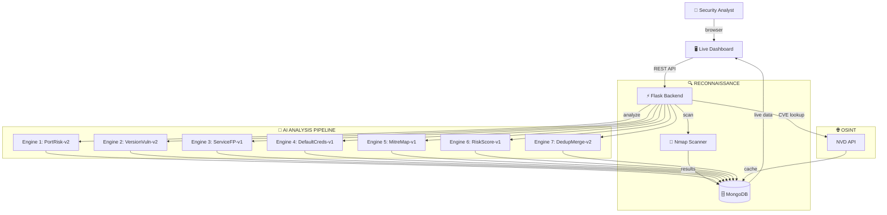

```
    ███╗   ██╗███████╗██╗  ██╗███████╗██╗  ██╗██╗███████╗██╗     ██████╗
    ████╗  ██║██╔════╝╚██╗██╔╝██╔════╝██║  ██║██║██╔════╝██║     ██╔══██╗
    ██╔██╗ ██║█████╗   ╚███╔╝ ███████╗███████║██║█████╗  ██║     ██║  ██║
    ██║╚██╗██║██╔══╝   ██╔██╗ ╚════██║██╔══██║██║██╔══╝  ██║     ██║  ██║
    ██║ ╚████║███████╗██╔╝ ██╗███████║██║  ██║██║███████╗███████╗██████╔╝
    ╚═╝  ╚═══╝╚══════╝╚═╝  ╚═╝╚══════╝╚═╝  ╚═╝╚═╝╚══════╝╚══════╝╚═════╝
```

<p align="center">
  <b>🛡️ AI-Powered Threat Intelligence Platform 🤖</b><br>
  <i>multi-model • real-time • offensive-ready</i><br><br>
  
  
  
  
  
</p>

---

## `> whoami`

NexShield is an **AI-driven cybersecurity dashboard** that automates network reconnaissance, identifies vulnerabilities across 27+ sensitive services, maps findings to **MITRE ATT&CK** techniques, and deduplicates threats using a 7-engine analysis pipeline.

```
┌──────────────────────────────────────────────────────────┐
│  "Scan. Analyze. Score. Hunt."                           │
│                                                          │
│  [✓] 7 AI Analysis Engines                               │
│  [✓] 27 Sensitive Port Signatures                         │
│  [✓] 10 CVE Pattern Matchers                              │
│  [✓] 13 Default-Credential Detectors                      │
│  [✓] 11 MITRE ATT&CK Technique Mappings                   │
│  [✓] Composite Per-Host Risk Scoring                       │
│  [✓] NVD CVE Lookup with MongoDB Caching                   │
│  [✓] Live Dashboard with Real-Time Polling                  │
└──────────────────────────────────────────────────────────┘
```

---

## `> cat /etc/architecture`



---

## `> ls -la engines/`

| # | Engine | Codename | What It Does |
|---|--------|----------|--------------|
| 1 | **Port Risk** | `PortRisk-Engine-v2` | Flags 27 sensitive ports (RDP, SMB, VNC, Redis, etc.) |
| 2 | **Version Vuln** | `VersionVuln-Engine-v2` | Regex CVE matching — Heartbleed, SambaCry, vsftpd backdoor |
| 3 | **Service Fingerprint** | `ServiceFP-Engine-v1` | Detects anomalous services on standard ports (masquerading/backdoors) |
| 4 | **Default Credentials** | `DefaultCreds-Engine-v1` | Flags 13 services with known weak/default creds |
| 5 | **MITRE ATT&CK Map** | `MitreMap-Engine-v1` | Maps findings to 11 ATT&CK techniques (T1021, T1071, T1190, T1210) |
| 6 | **Risk Scoring** | `RiskScore-Engine-v1` | Computes composite per-host risk score (severity + engine diversity + volume) |
| 7 | **Deduplication** | `DedupMerge-Engine-v2` | Merges duplicate threats, preserves provenance |

---

## `> cat features.log`

```
[+] 📊 Severity Timeline Chart    — Canvas-rendered stacked bars (7-day trend)
[+] 🔍 Threat Detail Modal        — Click any row → full intel slide-in panel
[+] 🔎 Search & Filter            — Real-time search by name, host, CVE, engine
[+] 📥 Export Reports              — Download as CSV or JSON (one-click)
[+] 📡 Scan History               — Rich feed of past scans with timestamps
[+] 🌐 CVE Lookup                 — Query NVD database for real CVE details
[+] 📋 Activity Log               — Live scrolling event feed
[+] 🎯 Manual Scan                — Custom target IP + port range from the UI
```

---

## `> ./install.sh` — Setup

### 🐉 Kali Linux / Debian

```bash
# ── Prerequisites ────────────────────────────────────
sudo apt update && sudo apt install nmap -y

# ── MongoDB (Kali) ───────────────────────────────────
sudo apt install mongodb -y
sudo systemctl start mongodb
sudo systemctl enable mongodb

# ── Clone & Setup ────────────────────────────────────
git clone https://github.com/<your-username>/nexshield.git
cd nexshield
python3 -m venv venv
source venv/bin/activate
pip install -r requirements.txt
```

### 🪟 Windows (PowerShell)

```powershell
# ── Prerequisites ────────────────────────────────────
# Download Nmap:   https://nmap.org/download.html
# Download MongoDB: https://www.mongodb.com/try/download/community

# ── Clone & Setup ────────────────────────────────────
git clone https://github.com/<your-username>/nexshield.git
cd nexshield
python -m venv venv
.\venv\Scripts\activate
pip install -r requirements.txt
```

---

## `> python app.py`

```bash
$ python app.py

==========================================================
   NexShield — AI-Powered Threat Intelligence Platform
   Dashboard -> http://127.0.0.1:5000
==========================================================
 * Serving Flask app 'app'
 * Running on http://0.0.0.0:5000
```

> Open `http://127.0.0.1:5000` in your browser. 🌐

---

## `> tree .`

```
nexshield/
├── app.py               # Flask API — 10 endpoints
├── ai_logic.py          # 7-engine AI analysis pipeline
├── scanner.py           # Nmap-powered network scanner
├── config.py            # MongoDB connection & collections
├── cve_lookup.py        # NVD API integration + caching
├── requirements.txt     # Python dependencies
├── README.md            # ← you are here
├── templates/
│   └── index.html       # Live dashboard (dark-mode)
└── static/
    ├── css/
    │   └── style.css    # Cybersecurity aesthetic
    └── js/
        └── script.js    # Frontend logic + Canvas chart
```

---

## `> curl /api/*`

| Endpoint | Method | Description |
|----------|--------|-------------|
| `/api/threats` | `GET` | Latest threats (filterable, limit param) |
| `/api/stats` | `GET` | Aggregate severity counts |
| `/api/timeline` | `GET` | 7-day threat trend data |
| `/api/scan` | `POST` | Trigger network scan `{target, ports}` |
| `/api/analyze` | `POST` | Run 7-engine AI pipeline |
| `/api/scan-history` | `GET` | Last 20 scans grouped by scan_id |
| `/api/export?format=csv` | `GET` | Download threats as CSV |
| `/api/export?format=json` | `GET` | Download threats as JSON |
| `/api/cve/<CVE-ID>` | `GET` | NVD CVE lookup with caching |
| `/api/activity` | `GET` | Last 50 activity log entries |

---

## `> cat /proc/mitre`

```
┌─────────────┬──────────────────────────────────────┐
│ Technique   │ Description                          │
├─────────────┼──────────────────────────────────────┤
│ T1021.001   │ Remote Desktop Protocol              │
│ T1021.002   │ SMB/Windows Admin Shares              │
│ T1021.004   │ SSH                                   │
│ T1021.005   │ VNC                                   │
│ T1021.006   │ Windows Remote Management             │
│ T1071.001   │ App Layer Protocol: Web               │
│ T1071.002   │ App Layer Protocol: File Transfer     │
│ T1071.003   │ App Layer Protocol: Mail              │
│ T1071.004   │ App Layer Protocol: DNS               │
│ T1190       │ Exploit Public-Facing Application     │
│ T1210       │ Exploitation of Remote Services       │
└─────────────┴──────────────────────────────────────┘
```

---

## `> ⚠️ /etc/legal`

> **This tool is intended for authorized security assessments and educational research ONLY.**
> Unauthorized scanning of networks you do not own or have written permission to test is **illegal**.
> The authors assume no liability for misuse. Always obtain proper authorization before scanning.

---

<p align="center">
  <b>Built with 🧠 by NexShield</b><br>
  <code>root@nexshield:~# echo "Hack the planet. Responsibly."</code>
</p>
